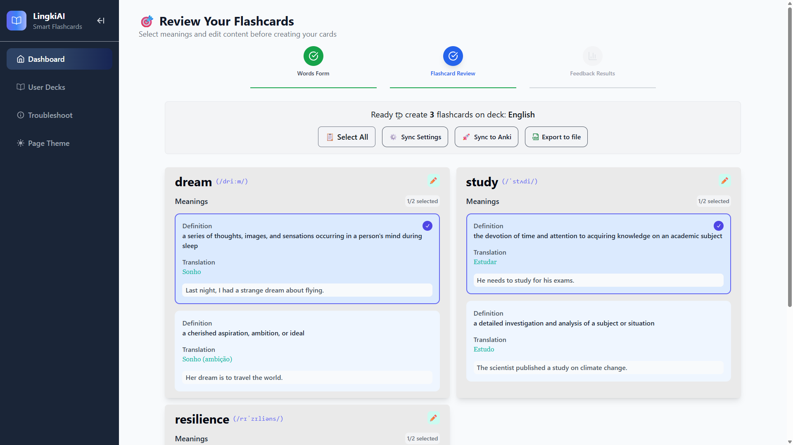

# LingkiAI

<!-- Improved compatibility of back to top link: See: https://github.com/LBruner/LingkiAI/pull/73 -->
<a id="readme-top"></a>


<!-- PROJECT SHIELDS -->

[![Contributors][contributors-shield]][contributors-url]
[![Forks][forks-shield]][forks-url]
[![Stargazers][stars-shield]][stars-url]
[![Issues][issues-shield]][issues-url]
[![Unlicense License][license-shield]][license-url]
[![LinkedIn][linkedin-shield]][linkedin-url]
[](https://wakatime.com/badge/github/LBruner/LingkiAI)


<!-- PROJECT LOGO -->
<br />
<div align="center">
  <h3 align="center">LingkiAI</h3>

  <p align="center">
    Anki's Language flashcards generation using AI
    <br />
    <a href="https://github.com/LBruner/LingkiAI"><strong>Explore the docs »</strong></a>
    <br />
    <br />
    &middot;
    <a href="https://github.com/LBruner/LingkiAI/issues/new?labels=bug&template=bug-report---.md">Report Bug</a>
    &middot;
    <a href="https://github.com/LBruner/LingkiAI/issues/new?labels=enhancement&template=feature-request---.md">Request Feature</a>
  </p>
</div>


<!-- TABLE OF CONTENTS -->
<details>
  <summary>Table of Contents</summary>
  <ol>
    <li>
      <a href="#about-the-project">About The Project</a>
      <ul>
        <li><a href="#built-with">Built With</a></li>
      </ul>
    </li>
    <li>
      <a href="#getting-started">Getting Started</a>
      <ul>
        <li><a href="#prerequisites">Prerequisites</a></li>
        <li><a href="#installation">Installation</a></li>
      </ul>
    </li>
    <li><a href="#contributing">Contributing</a></li>
    <li><a href="#license">License</a></li>
    <li><a href="#contact">Contact</a></li>
    <li><a href="#acknowledgments">Acknowledgments</a></li>
  </ol>
</details>


<!-- ABOUT THE PROJECT -->
## About The Project

[//]: # ([![Product Name Screen Shot][product-screenshot]]&#40;https://example.com&#41;)

LingkiAI is a tool that makes creating language-learning flashcards for Anki faster and easier.
Instead of manually preparing dozens or hundreds of cards before studying, LingkiAI uses the OpenAI API to instantly generate well-structured and properly formatted flashcards.

Key Features:

* AI-powered card generation — get ready-to-use flashcards in seconds.
* Multiple meanings per word — choose exactly which ones to keep.
* Two ways to add cards:
  * Sync directly with Anki via the AnkiConnect add-on (supports TTS audio).
  * Export to .tsv for manual import into Anki (no audio).
* Deck management — view, add, and delete decks.
* Statistics — track your learning resources.
* Usage guide — step-by-step instructions for both AnkiConnect and .tsv workflows.

Example Card:

```html
Front: She wants to <span style="color: rgb(231, 217, 15);">live</span> a long and happy life.[sound:0.716676793845195.mp3]  
Back: <span style="color: rgb(231, 217, 15);">LIVE</span> (/lɪv/)  
TO BE ALIVE; HAVE LIFE  
VIVER  
[sound:0.16948291024931428.mp3]
```

### Built With

* [![Next][Next.js]][Next-url]
* [![React][React.js]][React-url]
* [![Tailwind][Tailwind.com]][Tailwind-url]

<p align="right">(<a href="#readme-top">back to top</a>)</p>


## Imagens


<p align="center">
  
  
</p>
<p align="center">
  
  
</p>


<!-- GETTING STARTED -->
## Getting Started

This is an example of how you may give instructions on setting up your project locally.
To get a local copy up and running follow these simple example steps.

### Prerequisites

* ![NodeJS][Node-shield]

### Installation

There are two ways to use LingkiAI:

### 1. Use via Website (Coming Soon)
The easiest way will be through our web app, which will be deployed soon. Stay tuned!

---

### 2. Local Setup (Advanced)

If you prefer to run LingkiAI locally, follow these steps:

1. **Clone the repository:**
    ```bash
   git clone https://github.com/LBruner/LingkiAI
   cd lingkiai
   ```

2. **Install dependencies:**
      ```
      npm install 
      ```

3. **Create a `.env` file in the root folder with the following variables:**
    ```
    AI_API_URL=""
    LOCAL_API_URL=""
    AUTHORIZATION_TOKEN=""
    API_AUTHORIZATION_TOKEN=""
    ANKI_URL=""
    ```

4. **Build and start the app:**
    ```
    npm run build
    npm start
    ```
5. **Install the AnkiConnect add-on:**
- Open Anki
- Go to Tools > Add-ons > Get Add-ons
- Enter the code: 2055492159


    Or install via the link:  https://ankiweb.net/shared/info/2055492159

6. **Verify connection:**
   
    Navigate to the LingkiAI app URL and check the connection status.
    The system will inform you if it is connected to Anki.


        Tip: For best results, run LingkiAI with Anki open and AnkiConnect enabled to ensure immediate syncing with your decks.

<p align="right">(<a href="#readme-top">back to top</a>)</p>

<!-- CONTRIBUTING -->

## Contributing

<a id="contributing"></a>

If you have suggestions to improve the project, feel free to fork it and submit a pull request.  
You can also open an issue with the **"enhancement"** tag.

### How to Contribute

1. Fork the project
2. Create a branch for your feature:
    ```bash
    git checkout -b feature/FeatureName
    ```
3. Make your changes and commit:
    ```bash
    git commit -m "Add FeatureName"
    ```
4. Push to the remote repository:
    ```bash
    git push origin feature/FeatureName
    ```
5. Open a Pull Request in the original repository

<p align="right">(<a href="#readme-top">back to top</a>)</p>

---

<!-- LICENSE -->

<a id="license"></a>

## License

Distributed under the MIT License. See `LICENSE` for more information.

<p align="right">(<a href="#readme-top">back to top</a>)</p>

---

<!-- CONTACT -->

<a id="contact"></a>

## Contact

Leandro Bruner

[![Linkedin][linkedin-shield]][linkedin-url]  
[![Gmail][Gmail]][Gmail-url]

<p align="right">(<a href="#readme-top">back to top</a>)</p>

---

<!-- ACKNOWLEDGMENTS -->

<a id="acknowledgments"></a>

## Acknowledgments

I would like to acknowledge and thank the resources and tools that were helpful in the development of this project.

- HerouUI
- Img Shields
- React Icons
- Readme Template

<p align="right">(<a href="#readme-top">back to top</a>)</p>


<!-- MARKDOWN LINKS & IMAGES -->
<!-- https://www.markdownguide.org/basic-syntax/#reference-style-links -->
[contributors-shield]: https://img.shields.io/github/contributors/LBruner/LingkiAI.svg?style=for-the-badge
[contributors-url]: https://github.com/LBruner/LingkiAI/graphs/contributors
[forks-shield]: https://img.shields.io/github/forks/LBruner/LingkiAI.svg?style=for-the-badge
[forks-url]: https://github.com/LBruner/LingkiAI/network/members
[stars-shield]: https://img.shields.io/github/stars/LBruner/LingkiAI.svg?style=for-the-badge
[stars-url]: https://github.com/LBruner/LingkiAI/stargazers
[issues-shield]: https://img.shields.io/github/issues/LBruner/LingkiAI.svg?style=for-the-badge
[issues-url]: https://github.com/LBruner/LingkiAI/issues
[license-shield]: https://img.shields.io/github/license/LBruner/LingkiAI.svg?style=for-the-badge
[license-url]: https://github.com/LBruner/LingkiAI/blob/master/LICENSE.txt
[linkedin-shield]: https://img.shields.io/badge/-LinkedIn-black.svg?style=for-the-badge&logo=linkedin&colorB=333
[linkedin-url]: https://www.linkedin.com/in/lbruner-dev/
[product-screenshot]: images/screenshot.png
[Next.js]: https://img.shields.io/badge/next.js-000000?style=for-the-badge&logo=nextdotjs&logoColor=white
[Next-url]: https://nextjs.org/
[React.js]: https://img.shields.io/badge/React-20232A?style=for-the-badge&logo=react&logoColor=61DAFB
[React-url]: https://reactjs.org/
[Vue.js]: https://img.shields.io/badge/Vue.js-35495E?style=for-the-badge&logo=vuedotjs&logoColor=4FC08D
[Vue-url]: https://vuejs.org/
[Angular.io]: https://img.shields.io/badge/Angular-DD0031?style=for-the-badge&logo=angular&logoColor=white
[Angular-url]: https://angular.io/
[Svelte.dev]: https://img.shields.io/badge/Svelte-4A4A55?style=for-the-badge&logo=svelte&logoColor=FF3E00
[Svelte-url]: https://svelte.dev/
[Laravel.com]: https://img.shields.io/badge/Laravel-FF2D20?style=for-the-badge&logo=laravel&logoColor=white
[Laravel-url]: https://laravel.com
[Bootstrap.com]: https://img.shields.io/badge/Bootstrap-563D7C?style=for-the-badge&logo=bootstrap&logoColor=white
[Bootstrap-url]: https://getbootstrap.com
[JQuery.com]: https://img.shields.io/badge/jQuery-0769AD?style=for-the-badge&logo=jquery&logoColor=white
[JQuery-url]: https://jquery.com
[Tailwind.com]: https://img.shields.io/badge/Tailwind_CSS-grey?style=for-the-badge&logo=tailwind-css&logoColor=38B2AC

[Tailwind-url]: https://tailwindcss.com/
[Node-shield]: https://img.shields.io/badge/node.js-339933?style=for-the-badge&logo=Node.js&logoColor=white
[linkedin-shield]: https://img.shields.io/badge/-LinkedIn-black.svg?style=for-the-badge&logo=linkedin&colorB=333

[linkedin-url]: https://www.linkedin.com/in/lbruner-dev/

[Gmail]: https://img.shields.io/badge/Gmail-D14836?style=for-the-badge&logo=gmail&logoColor=white

[Gmail-url]: mailto:leandrobruner15@gmail.com
